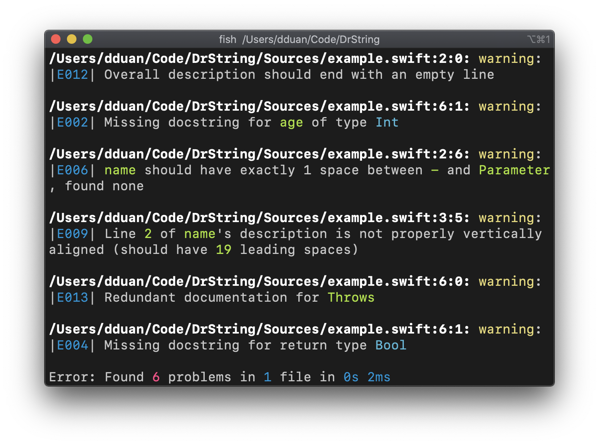

# Getting Started with DrString

This tutorial teaches the basics of installing and using DrString.

Read [overview][] if you aren't sure about using DrString.

[overview]: overview.md

## Install

### With Homebrew

```bash
brew install dduan/formulae/drstring
```

### With [Mint](https://github.com/yonaskolb/Mint)

```
mint install dduan/DrString
```

### From source

You'll need Swift 5.1 on your system.

```bash
git clone https://github.com/dduan/DrString.git
cd DrString
make install
```

If you prefer a slightly more manual approach. Instead of running `make
install`, first build DrString with `make build`, then move the executable
`.build/release/drstring` to a location you'd like to invoke it from.

## Usage

DrString is a CLI tool with subcommands. Some subcommands include many options
that customizes its behavior. These options can be expressed via either command
line arguments, or a configuration file.

### Checking for docstring problems

The `check` subcommand finds problems of existing docstrings:

```bash
drstring check -i 'Sources/**/*.swift'
```

In this example, all Swift files under `./Sources` will be examined recursively.
Paths is the only required option for the `check` command.

Another example:

```bash
drstring check \
    --include 'Sources/**/*.swift' \
    --include 'Tests/**/*.swift' \
    --exclude 'Tests/Fixtures/*.swift' \
    --ignore-throws true \
    --first-letter uppercase
```

1. `--include` is the longer form of `-i`. Most options have a long form and
   a short form. This should be a familar Unix pattern.
2. You can exampt paths from being checked with `--exclude` (or `-e`).
3. `--include` and `--exclude` can repeat. In fact, this is true for all options
   that takes a list of values.
4. `--ignore-throws` tells DrString documentation for `throws` is not required.
   `--first-letter` tells DrString to expect keywords in docstring such as
   `Parameter` should start with an uppercase letter. These are examples of
   options that customizes DrString's behavior. They exist to cater different
   style needs in different codebases.

There are many more [options][] for customizing DrString's behavior.

### Explainers

An output of the `check` command may look like this:



You may have noticed some texts before each problem that reads like `|E008|`.
This is an ID for this category of problems. DrString has an `explain`
subcommand that takes the ID as argument:

```bash
drstring explain E008
```

In this example, DrString will proceed to print out an explanation of the
problem with examples that demonstrates the violation.

**Protip**: You can use partial IDs and DrString will try its best to guess what
you want to know. For example, instead of typing `E008`, `E8` or `8` or `008`
all get you the same result.

### Using a config file

Instead of specifying request with command line arguments, DrString can read
from a configuration file instead. The second example for `check` command can
be expressed in a configuration file as

```toml
include = [
    'Sources/**/*.swift',
    'Tests/**/*.swift',
]

exclude = [
    'Tests/Fixtures/*.swift',
]

ignore-throws = true
first-letter = "uppercase"
```

Save this file as `.drstring.toml` in the current worknig directory and simply
run `drstring` will cause DrString to do the exact same thing as the CLI
argument examlpe.

The configuration file is in [TOML][] format.

[TOML]: https://github.com/toml-lang/toml

### Getting help

`-h` or `--help` is an option for all subcommands as well as the "root" command.
It's good for a quick reminder of what's available.

Read the [documentation for options][options] to learn more about ways to
enforec different docstring styles.

[options]: Configuration.md
