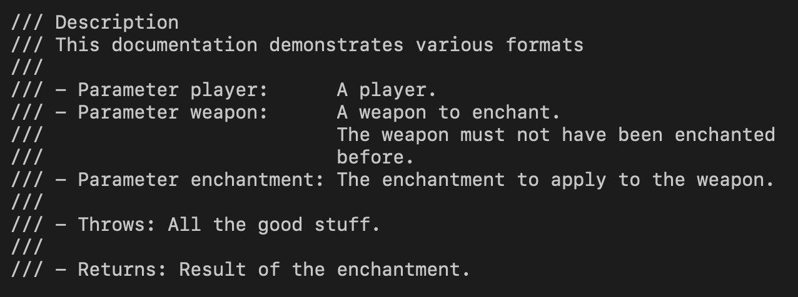

# Overview 

This document answers the following questions:

- Why would one need something like DrString?
- What's in a docstring?

## Consistency is hard

[Docstring][] is an important part of a codebase. 

Just like all forms of documentation, it goes out of date as code evolves. Even
with the most conscientious team and best of intentions, keeping it 100% fresh
is time-consuming and difficult.

There are many subtle ways a docstring can be "correct":

Picking a style and sticking to it is nice, but spending time in code reviews
to maintain a consistent style is a trade of much efforts with low rewards.

Finally, just like code formats, whitespace errors happens all the time.

For these reason, docstring consistency is essentially impossible.
A linter/formatter like DrString makes life a bit easier for those who cares.

[Docstring]: https://en.wikipedia.org/wiki/Docstring

## Anatomy of a docstring in Swift

Pedantry begins with a glossary. So let's look at what elements of a docstring
we can scrutinize about.

(_TODO: this section only talks about docstring for function signatures, there
are other docstring-worthy stuff._)

A docstring is a block of consecutive lines that all starts with `///`. The
first `/` is indented to the same column as its "documentee".

Each parts of a signature corresponds to a section. This includes
- an overall description of the signature
- a description for each parameter
- a description for what it throws if it throws anything
- a description for what it returns, if anything

Sometimes sections are separated with a empty docstring line. Some codebases
don't care about certain sections, such as `throws`.

The keywords "Parameters", "Parameter", "Throws", and "Returns" serve as
prefixes to parts of the docstring. They should be spelled correctly. Their
first letter could be upper- or lowercase by preference, and it's a source of
inconsistency.

Auxillary characters such as `-` and `:`.

Space characters (and lack there of) surrounding various parts. Most of the time
this is pretty strict ("no space before `:`", "1 space after `-`", etc). They
make things visually align vertically.

There are 2 common ways to organize description for multiple parameters (thanks
to Xcode changing its generated docstring over the years).

- The _grouped_ style starts the section with a `- Parameters` header in its own
  line. And each parameter following it is indented, and doesn't need the
  `Parameter` keyword.
- The _separate_ style doesn't have a header for parameters. Each parameter
  begins with ` - Parameter` or ` - parameter`.

DrString analyzes all of these aspects of your docstring and reports each
problem it finds. Each reported problem comes with an explanation linked by an
identifier. The "explainers" are part of the CLI app as well as the
[documentation](https://github.com/dduan/DrString/tree/master/Documentation/Explainers).
