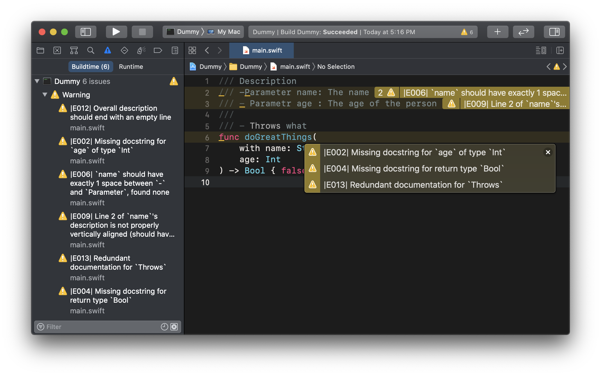

# Dr. String in the Multiverse of Pedantry

… or "DrString", for short.

DrString helps you take control of docstrings in your Swift codebase by finding
and fixing inconsistencies among them.

## Documentation

- [Getting Started][] guides you through how to use DrString in your Swift
  project.
- [Overview][] provides the _why_ s and _what_ s of docstring linting.
- [Configuration][] is a reference to all options for behavior customization.
- [Editor Integrations][] exist to improve your user experience.

[Getting Started]: Documentation/GettingStarted.md
[Overview]: Documentation/Overview.md
[Configuration]: Documentation/Configuration.md
[Editor Integrations]: Documentation/EditorIntegrations.md

## License

[MIT](LICENSE.md).
