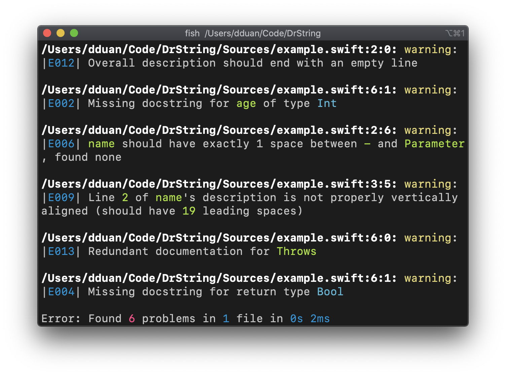

# DrString in the Multiverse of Pedantry

… or "DrString", for short.

DrString finds problems in your Swift docstrings.

## Documentation

- [Getting Started][] guides you through how to use DrString in your Swift
  project.
- [Overview][] provides the _why_ s and _what_ s of docstring linting.
- [Configuration][] is a reference to all options for behavior customization.

[Getting Started]: Documentation/GettingStarted.md
[Overview]: Documentation/Overview.md
[Configuration]: Documentation/Configuration.md

## License

[MIT](LICENSE.md).
